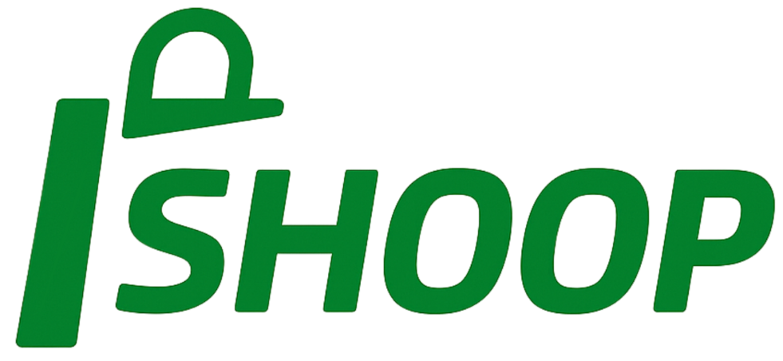
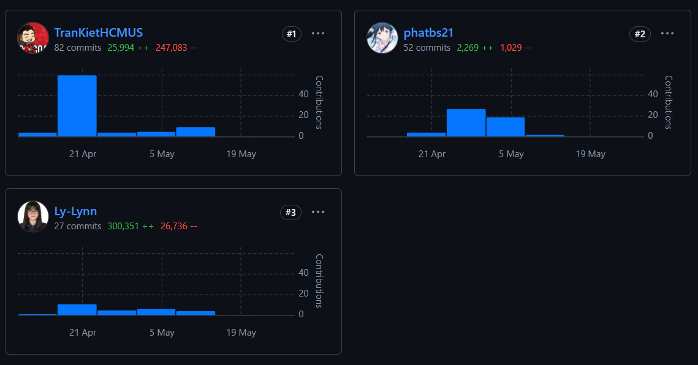
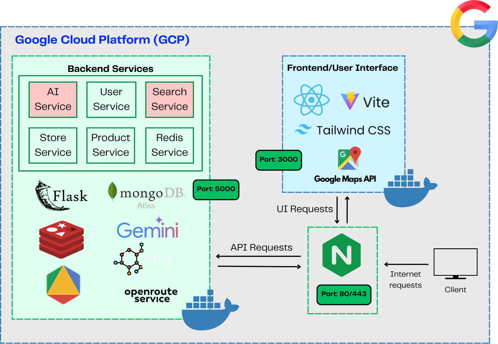
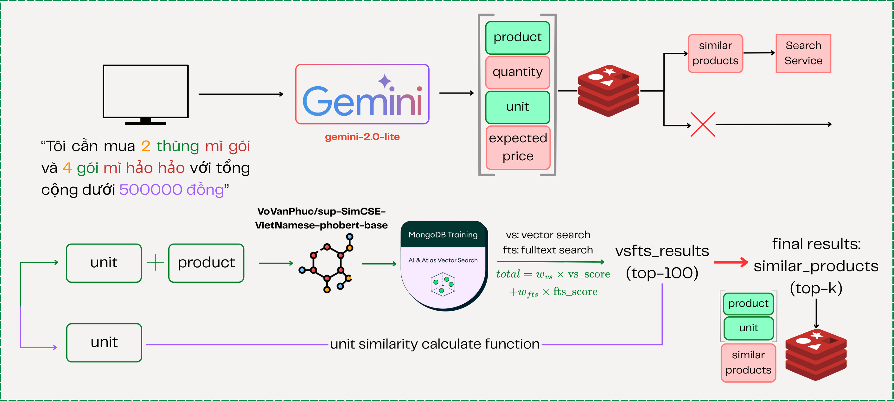
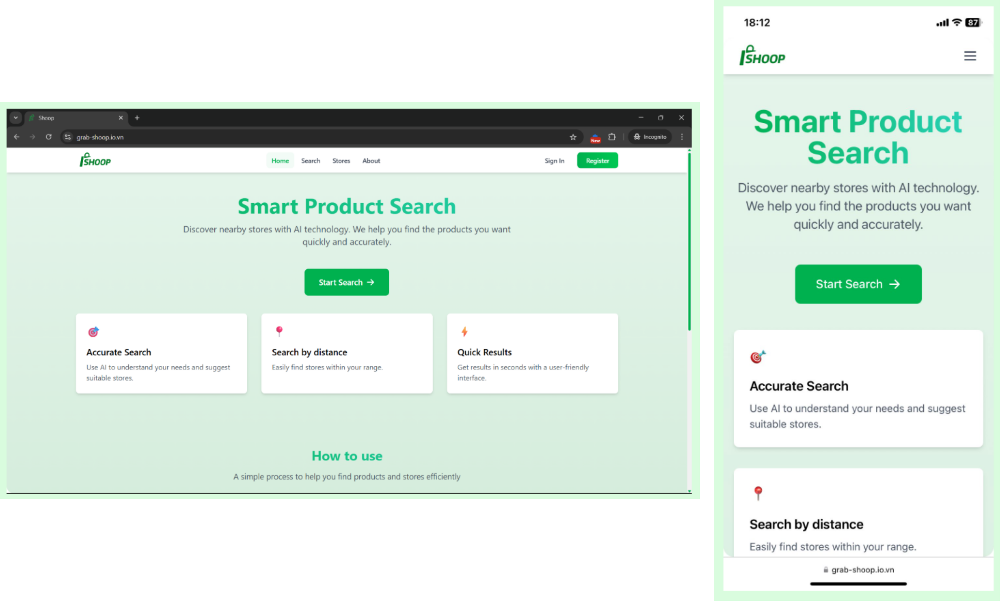

# SHOOP - Shopping Optimization 🛍️

<div align="center">
  <br>
  
  
  [](https://www.grab.careers/en/vietnam-grab-bootcamp-2025/)

  [](http://grab-shoop.io.vn/)
  
  > 🚀 An AI-powered shopping optimization application that helps find nearby stores and suggests optimized shopping routes.
</div>

## 📑 Table of Contents
- [Overview](#-overview)
- [Key Features](#-key-features)
- [Technologies](#%EF%B8%8F-technologies)
- [Personal Contribution](#-personal-contribution)
- [Project Structure](#-project-structure)
- [Installation Guide](#-installation-guide)
- [Contact](#-contact)

## 🌟 Overview

**SHOOP** is a smart shopping assistant developed as part of the Grab Vietnam Tech Bootcamp 2025. The application leverages AI technology to deliver an optimized shopping experience for users.

## ✨ Key Features

- 🛒 Find optimal shopping locations within customizable distances
- 🗺️ Get efficient shopping route suggestions
- 🤖 Smart shopping list analysis powered by AI
- 📱 User-friendly, responsive interface across all devices

## ⚙️ Technologies

| Layer       | Technologies                                                   |
|-------------|---------------------------------------------------------------|
| **Backend** | Python, Flask, OpenAI API, MongoDB Atlas, Redis               |
| **Frontend**| React, Vite, JavaScript, TailwindCSS, ESLint                 |
| **Pipeline**| Apache Airflow, Docker, Docker Compose                        |
| **DevOps**  | Google Cloud Compute Engine, Nginx, Git, Conda               |

## 🌟 Personal Contribution

<div align="center">
  
</div>

### Backend
- ✅ Developed AI service using **LLMs** for user request analysis
- 🔍 Implemented and optimized **semantic search** and **full-text search**
- 🗃️ Designed **MongoDB Atlas** schema and integrated **vector search**
- ☁️ Deployed backend services to **Google Cloud Compute Engine**
- 🌐 Configured **Nginx reverse proxy** for production environment

<div align="center">
  
  
</div>

### Frontend
- 🎨 Designed UI and developed core components using **React + Vite + TailwindCSS**
- 📱 Ensured responsive design and optimal user experience across all devices
<div align="center">
  
</div>

## 📁 Project Structure

```
.
├── backend/    # Python Flask API
├── frontend/   # React (Vite) application
└── pipeline/   # Data pipeline with Airflow + Docker
```

## 🚀 Installation Guide

### System Requirements
- [Python](https://www.python.org)
- [Node.js & npm](https://nodejs.org/en/download/)
- [Docker & Docker Compose](https://docs.docker.com/get-docker/)

### Backend
```bash
# 1. Navigate to backend directory
cd backend

# 2. Create and activate conda environment
conda env create -f environment.yml
conda activate grab-test

# 3. Install dependencies
pip install -r requirements.txt

# 4. Create .env file for API keys and DB config
cp .env.example .env

# 5. Run backend service
python app.py
```
Backend runs at http://localhost:3000

### Frontend
```bash
# 1. Navigate to frontend directory
cd frontend

# 2. Install dependencies
npm install

# 3. Create .env file with required environment variables
cp .env.example .env

# 4. Run Vite development server
npm run dev
```
Frontend available at http://localhost:5173

### Pipeline (Airflow)
```bash
# 1. Navigate to pipeline directory
cd pipeline

# 2. Build and start Airflow services
docker-compose up -d --build
```
Access Airflow UI at http://localhost:8080


## 📫 Contact

If you have any questions or feedback, please don't hesitate to reach out!